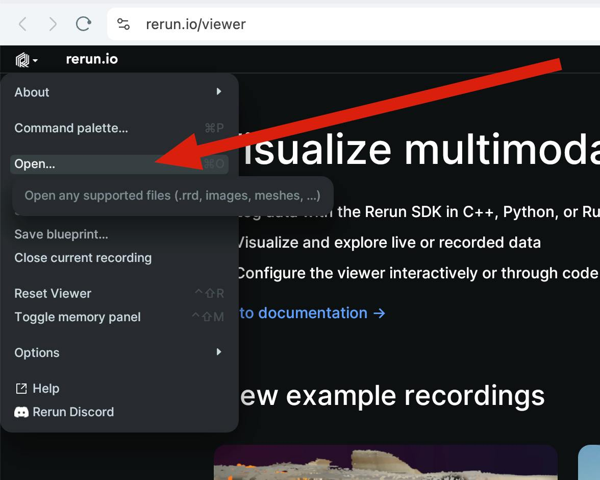

# `rerun-yolov10`

## Overview

Demo of [rerun][1] with real-time object detection provided in YOLO v10.

## Install

```
uv venv --python 3.12

source .venv/bin/activate

uv pip install -r requirements.txt

# in development mode
uv pip install -r requirements-dev.txt
```

## Download a video

```bash
wget -O video_demo.mp4 "https://www.dropbox.com/scl/fi/2eefx65omqmou5c57vuwm/video_2.mp4?rlkey=a5pqjr07l9wklfockeb2950i6&st=phfmw3ii&dl=0"
```

## Run

```bash
python recognize_objects.py
```

## Start `rerun` and open the web viewer

```bash
rerun --serve recording.rrd
```

Open the web viewer at http://localhost:9090/?url=ws://localhost:9877

## Or upload `recording.rrd` to https://rerun.io/viewer

 


[1]: https://github.com/rerun-io/rerun
